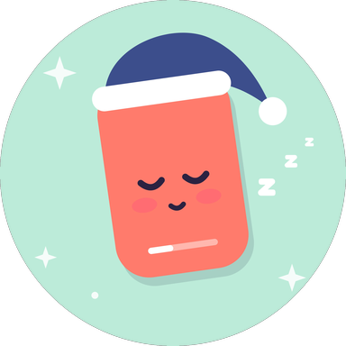

  

<h1 align="center">Snoozy</h1>

<b>Reels &amp; Shorts, fast asleep.</b>

Snoozy is an Android app that puts Instagram Reels and YouTube Shorts to sleep. When you open them, Snoozy covers the video with a calm night screen, while the rest of each app keeps working: your feed, DMs, stories, profile, search and regular YouTube videos.

## Get it

**Snoozy is free on Google Play: [download it here](https://play.google.com/store/apps/details?id=com.snoozy.app).**

The code is open source so anyone can see exactly what the app does. You don't need to build it yourself: the Play Store version is the same app, free, and updates automatically.

## What it does

- **Covers only the scroll.** The Reels and Shorts players get a night screen with a back button. The app's own tab bar stays visible, so you can tap somewhere else.
- **Mutes the covered video** so nothing plays behind the cover.
- **Snooze timer.** Pick a minimum snooze, from 15 minutes up to 24 hours, and Snoozy won't let you turn it off early. You can set your own timer options in hours and minutes.
- **Friends' Reels.** When a friend sends you a Reel in your Instagram DMs, you can watch that one Reel. Swiping to more stays blocked. Choose which chats are allowed, or allow or block them all at once.

## Privacy

- No account, no ads, no tracking, no analytics.
- **No internet access.** The app doesn't request Android's internet permission, so nothing can leave your phone.
- Snoozy uses Android's Accessibility Service only inside Instagram and YouTube, to spot the Reels and Shorts players. For Friends' Reels it reads the name of the open DM chat. It never reads your messages or anything you type.
- Settings are stored only on your device and are deleted when you uninstall.

Full details: [Privacy Policy](https://snoozyapp.github.io/privacy.html) · [Terms of Service](https://snoozyapp.github.io/terms.html) · [Website](https://snoozyapp.github.io)

## Requirements

Android 8.0 or newer.

---

Snoozy is an independent app and is not affiliated with, endorsed by or sponsored by Instagram, Meta, YouTube or Google.
